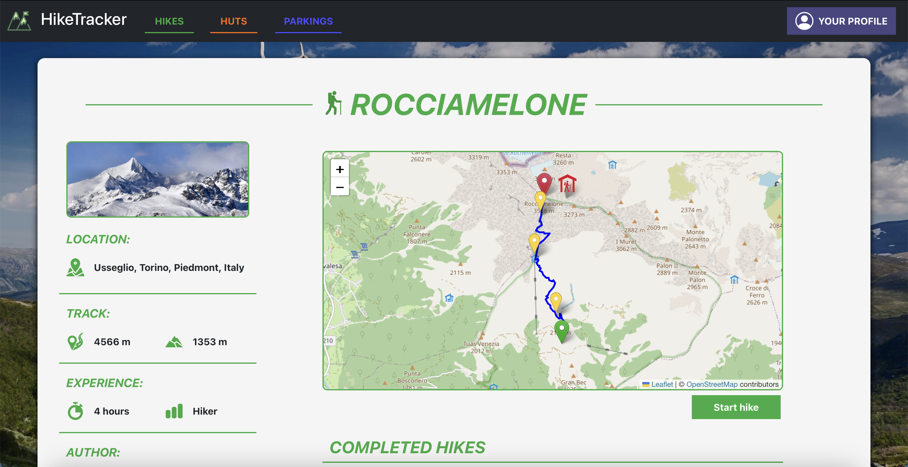
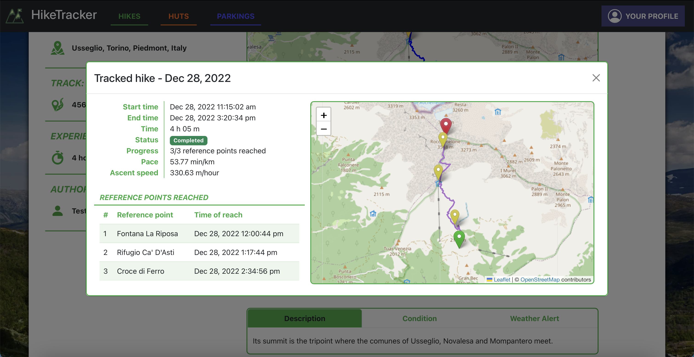

# SE2022-11-HikeTracker

This repository contains the main project developed (by group 11) throughout the Software Engineering II course @ Politecnico di Torino. It consists of a web application to browse hikes and huts and to track personal hikes.

[🌐 Qui in italiano](README_it.md)

## Features
- Browse hikes, huts and parkings using a series of filters
- See an hike condition and weather reports for the area
- Track an ongoing hike and mark reached reference points
- Visualize general performance statistics, summarizing all registered hikes
- As a local guide or a hut worker, manage hikes and huts information
- As a manager of the system, approve local guides and hut workers

## Technology

The application is developed in JavaScript and uses a two-server architecture: it uses Express as a framework for the backend and React for the frontend.

## Screenshots

|  Home page |  Explore hikes |
| :-------------: | :-------------: |
|  **Hike page** |  **Tracked hike** |

## Hard-coded users
| Email | Password | Access right |
|-------|----------| ----------- |
| manager@p.it | password | Platform manager |
| hiker@p.it | password | Hiker |
| local-guide@p.it | password | Local guide |
| hut-worker@p.it | password | Hut worker |

## Running the software
The software can be executed by running the services' Docker containers.

### Docker commands for client

To use the Docker service for client:

- `git pull origin main` 
- `docker pull erengul/se2022-11-hiketracker-client:latest`
- `docker run -it -p 3000:3000 erengul/se2022-11-hiketracker-client:latest`
    
It will run over the 3000 port.

### Docker commands for server

To use the Docker for server:

- `git pull origin main`
- `docker pull erengul/se2022-11-hiketracker-server:latest`
- `cd /server/`
- `sudo docker run -v $PWD/db:/db -p 3001:3001 erengul/se2022-11-hiketracker-server:latest`   
        
It will run over the 3001 port.

### Run both services

In the root folder, run `docker-compose build && docker-compose up`.

- https://hub.docker.com/repository/docker/erengul/se2022-11-hiketracker

### Commands for testing
`cd ./server`

`npm run test` (Unit Tests) 

`npm run apiTest` (Integration Tests)

### Tests status

