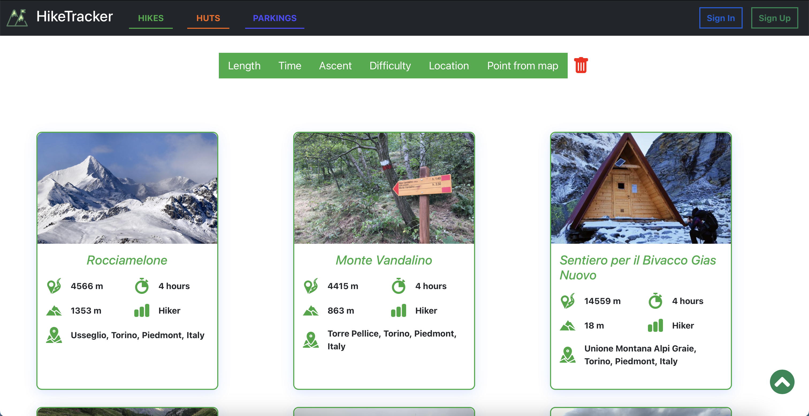
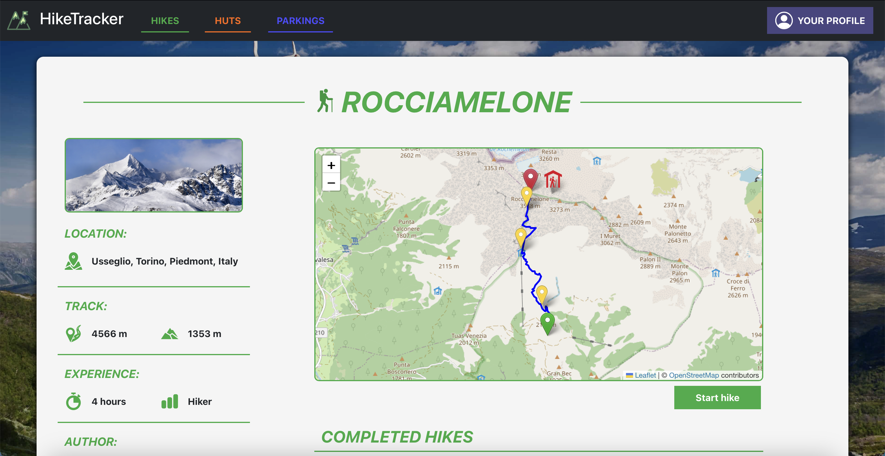
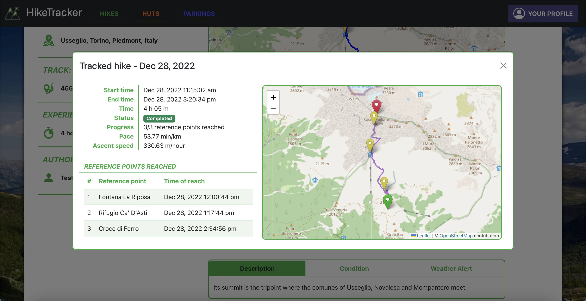

# SE2022-11-HikeTracker

Il repository contiene il progetto principale sviluppato (dal gruppo 11) durante il corso di Software Engineering II al Politecnico di Torino. Si tratta di un'applicazione web per scoprire sentieri e rifugi e per tenere traccia di escursioni personali.

[🌐 Here in English](README.md)

## Feature
- Esplora sentieri, rifugi e parcheggi utilizzando una serie di filtri
- Visualizza le condizioni di un sentiero e segnalazioni meteorologiche per l'area
- Tieni traccia di un'escursione in corso e segna come raggiunti i punti di riferimento
- Visualizza statistiche generali sulle performance che riassumono tutte le escursioni registrate
- In qualità di guida locale o lavoratore presso un rifugio, gestisci le informazioni dei sentieri e dei rifugi
- In qualità di gestore del sistema, approva guide locali e lavoratori dei rifugi

## Tecnologia

L'applicazione è sviluppata in JavaScript e usa un'architettura a due server: usa Express come framework per il backend e React per il frontend.

## Screenshot

|  Pagina principale |  Esplora i sentieri |
| :-------------: | :-------------: |
|  **Pagina di un sentiero** |  **Escursione registrata** |

## Utenti già presenti nel database
| Email | Password | Diritti di accesso |
|-------|----------| ----------- |
| manager@p.it | password | Gestore della piattaforma |
| hiker@p.it | password | Escursionista |
| local-guide@p.it | password | Guida locale |
| hut-worker@p.it | password | Lavoratore presso un rifugio |

## Eseguire il software
Il software può essere eseguito lanciando i container Docker dei vari servizi.

### Comandi Docker per il client

Per utilizzare il servizio Docker per il client:

- `git pull origin main` 
- `docker pull erengul/se2022-11-hiketracker-client:latest`
- `docker run -it -p 3000:3000 erengul/se2022-11-hiketracker-client:latest`
    
Verrà eseguito sulla porta 3000.

### Comandi Docker per il server

Per utilizzare il servizio Docker per il server:

- `git pull origin main`
- `docker pull erengul/se2022-11-hiketracker-server:latest`
- `cd /server/`
- `sudo docker run -v $PWD/db:/db -p 3001:3001 erengul/se2022-11-hiketracker-server:latest`   
        
Verrà eseguito sulla porta 3001.

### Eseguire entrambi i servizi

Nella cartella principale, eseguire `docker-compose build && docker-compose up`.

- https://hub.docker.com/repository/docker/erengul/se2022-11-hiketracker

### Comandi per eseguire i test

`cd ./server`

`npm run test` (Unit Tests) 

`npm run apiTest` (Integration Tests)

### Stato dei test

